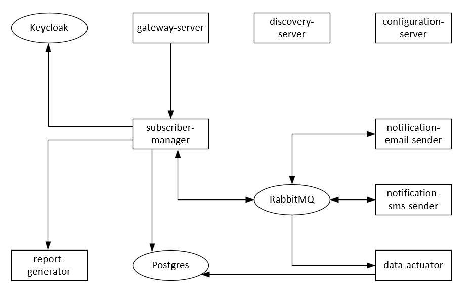

#  Информация о проекте
### SubSystem - Автоматизированная система управления абонентами
### Поддерживается следующий набор возможностей:
- управление сущностью "Абонент"
- управление сущностью "Платеж"
- управление сущностью "Канал платежа"
- управление сущностью "Начисление"
- управление сущностью "Причина начисления"
- управление сущностью "Город"
- управление сущностью "Улица"
- генерация абонентских отчетов
- отправка абонентских уведомлений
- миграция данных из внешнего источника

### Компоненты системы:

- **_subscriber-manager_** - ядро системы, содержит основную логику по управлению абонентами
- **_data-actuator_** - выполняет миграцию базы данных абонентов (используется для поддержания системы в актуальном состоянии, если есть внешний источник данных)
- **_report-generator_** - выполняет генерацию отчетов
- **_notification-email-sender_** - выполняет отправку нотификаций через email
- **_notification-sms-sender_** - выполняет отправку нотификаций через sms
- **_configuration-server_** - обеспечивает централизованное хранение конфигураций системы
- **_discovery-server_** - обеспечивает управление компонентами системы
- **_gateway-server_** - выполняет маршрутизацию запросов от клиента к компонентам системы

### Схема проекта



# Контакты
- [Ермолаев Евгений](mailto://ermolaev.evgeniy.96@yandex.ru)

# Используемые технологии

- Java 17
- Maven
- Spring Boot
- Spring Cloud
- Jasper Reports
- Postgres
- RabbitMQ
- Keycloak

# Сборка проекта

```bash
mvn clean install
```

# Docker команды
### Запуск кластера
```bash
docker-compose up -d
```
### Остановка кластера
```bash
docker-compose down
```